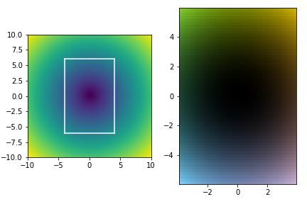

# Module `wsp_tools`

wsp\_tools contains utilities for TEM data analysis and presentation.

asdf

Features:

  - Single Image TIE
  - Lorentz simulations - phase calculations, propagation
  - spatial mode implementations - LG, Bessel beams, Bessel packets
  - basic image processing - high\_pass, low\_pass, clipping
  - a matplotlib.pyplot wrapper
  - an implementation of the CIELAB colorspace
  - a scipy.constants (CODATA values) wrapper that allows unit scaling
    (i.e., using nanometers instead of meters)

## Sub-modules

  - [wsp\_tools.beam](#wsp_tools.beam)
  - [wsp\_tools.cielab](#wsp_tools.cielab)
  - [wsp\_tools.constants](#wsp_tools.constants)
  - [wsp\_tools.image\_processing](#wsp_tools.image_processing)
  - [wsp\_tools.lorentzSim](#wsp_tools.lorentzSim)
  - [wsp\_tools.pyplotwrapper](#wsp_tools.pyplotwrapper)
  - [wsp\_tools.sitie](#wsp_tools.sitie)

# Module `wsp_tools.beam`

Module to generate spatial modes and calculate beam parameters.

## Functions

### Function `LG`

> 
> 
>     def LG(
>         x,
>         y,
>         z=0,
>         l=0,
>         p=0,
>         w_0=2e-06,
>         lam=1.97e-12
>     )

Generates a Laguerre-Gauss spatial mode.

Note: broadcasting is not supported - if x and y are both 1d arrays, the
result will be a 1darray and will NOT make sense. Likewise if x, y are
2d arrays, but z is a 1d array, the result will be an error.

**Parameters**

  - **x** : *number, ndarray* <br /> The x-coordinates over which to
    calculate the beam.

  - **y** : *number, ndarray* <br /> The y-coordinates over which to
    calculate the beam.

  - **z** : *number, ndarray, optional* <br /> The z-coordinates over
    which to calculate the beam. <br /> Default is `z = 0`.

  - **l** : *number, optional* <br /> The winding number, or chirality,
    of the beam. <br /> Default is `l = 0`.

  - **p** : *number, optional* <br /> The radial index of the beam.
    <br /> Default is `p = 0`.

  - **w\_0** : *number, optional* <br /> The beam waist. <br /> Default
    is `w_0 = 2e-6`.

  - **lam** : *number, optional* <br /> The beam’s wavelength. <br />
    Default is `lam = 1.97e-12` (the relativistic wavelength of a 300keV
    electron).

**Returns**

  - **mode** : *ndarray* <br /> The complex amplitudes of a Laguerre
    Gaussian beam at the specified x, y, and z positions.

### Function `bessel`

> 
> 
>     def bessel(
>         x,
>         y,
>         z=0,
>         l=0,
>         kz0=3191460985702.0464,
>         kperp=1595730492.8510232,
>         dkperp=0,
>         N=30
>     )

Creates a Bessel beam by adding plane waves.

The spectrum is a circle in k-space <br />`(kz0, dkperp + kperp *
cos(theta), kperp * sin(theta))`.

**Parameters**

  - **x** : *number, ndarray* <br /> the x-coordinates over which to
    calculate the beam.

  - **y** : *number, ndarray* <br /> the y-coordinates over which to
    calculate the beam.

  - **z** : *number, ndarray, optional* <br /> the z-coordinates over
    which to calculate the beam. <br /> Default is `z = 0`.

  - **l** : *number, optional* <br /> the winding number, or chirality,
    of the beam. <br /> Default is `l = 0`.

  - **kz0** : *number, optional* <br /> the z-coordinate of the
    spectrum. That is, the z component of the beam’s wavevector. <br />
    Default is `kz0 = k(3e5)`.

  - **kperp** : *number, optional* <br /> the perpendicular component of
    the spectrum. That is, the perpendicular component of the beam’s
    wavevector. This is the radius of the beam’s spectrum. <br />
    Default is `kperp = 5e-4 * k(3e5)`.

  - **dkperp** : *number, optional* <br /> the perpendicular offset of
    the spectrum. This is applied in the <code>k\_x</code> direction.
    <br /> Default is `dkperp = 0`.

  - **N** : *int, optional* <br /> The number of plane waves to use.
    <br /> Default is `N = 30`.

**Returns**

  - **mode** : *ndarray* <br /> The complex amplitudes of the Bessel
    beam at the specified x, y, and z positions. Shape is broadcast
    between x, y, and z inputs.

### Function `besselPacket`

> 
> 
>     def besselPacket(
>         t=0,
>         l=0,
>         kres=128,
>         kmin=-9574382957106.139,
>         kmax=9574382957106.139,
>         kz0=3191460985702.0464,
>         kperp=1595730492851.0232,
>         dkperp=0,
>         sig=159573049285.10233
>     )

Creates a bessel beam by Fourier transforming a Gaussian spectrum.

The spectrum is a gaussian centered on a circle in k-space <br /> `(k_z,
dkperp + kperp * cos(theta), kperp * sin(theta))`.

**Parameters**

  - **t** : *number, optional* <br /> time in seconds. <br /> Default is
    `t = 0`.

  - **l** : *number, optional* <br /> the winding number, or chirality,
    of the beam. <br /> Default is `l = 0`.

  - **kres** : *int, optional* <br /> the resolution of the k-space;
    also, the resolution of the output beam. Note that the function will
    be faster if the resolution is a power of 2. <br /> Default is `kres
    = 128`.

  - **kmin** : *number, optional* <br /> the minimum value in k-space.
    This is applied to the x, y, and z components of the wavenumber.
    <br /> Default is `kmin = -3 * k(3e5)`.

  - **kmax** : *number, optional* <br /> the maximum value in k-space.
    This is applied to the x, y, and z components of the wavenumber.
    <br /> Default is `kmax = 3 * k(3e5)`.

  - **kz0** : *number, optional* <br /> the z-coordinate of the
    spectrum. That is, the z component of the beam’s wavevector. <br />
    Default is `kz0 = k(3e5)`.

  - **kperp** : *number, optional* <br /> the perpendicular component of
    the spectrum. That is, the perpendicular component of the beam’s
    wavevector. This is the radius of the beam’s spectrum. <br />
    Default is `kperp = 5e-4 * k(3e5)`.

  - **dkperp** : *number, optional* <br /> the perpendicular offset of
    the spectrum. This is applied in the <code>k\_x</code> direction.
    <br /> Default is `dkperp = 0`.

  - **sig** : *number, optional* <br /> the standard deviation of the
    Gaussian envelope around the circle in k-space. <br /> Default is
    `sig = 0.05 * k(3e5)`.

**Returns**

  - **mode** : *ndarray* <br /> three-dimensional array containing the
    complex amplitudes of the Bessel packet. Shape is
    <code>kres</code>x<code>kres</code>x<code>kres</code>.

### Function `dB`

> 
> 
>     def dB(
>         T_eV
>     )

Calculates the de Broglie wavelength from the electron’s kinetic energy.

**Parameters**

  - **T\_eV** : *number* <br /> the kinetic energy in eV.

**Returns**

  - **dB(T\_eV)** : *number* <br /> the de Broglie wavelength in m.

### Function `energy`

> 
> 
>     def energy(
>         T_eV
>     )

Calculates the total electron energy from its kinetic energy.

**Parameters**

  - **T\_eV** : *number* <br /> the kinetic energy in eV.

**Returns**

  - **energy(T\_eV)** : *number* <br /> the total energy in eV.

### Function `k`

> 
> 
>     def k(
>         T_eV
>     )

Calculates the wavenumber from the electron’s kinetic energy.

**Parameters**

  - **T\_eV** : *number* <br /> the kinetic energy in eV.

**Returns**

  - **k(T\_eV)** : *number* <br /> the wavenumber in m<sup>-1</sup>.

### Function `omega`

> 
> 
>     def omega(
>         T_eV
>     )

Calculates the angular frequency from the electron’s kinetic energy.

**Parameters**

  - **T\_eV** : *number* <br /> the kinetic energy in eV.

**Returns**

  - **omega(T\_eV)** : *number* <br /> the angular frequency in rad
    s<sup>-1</sup>.

### Function `p`

> 
> 
>     def p(
>         T_eV
>     )

Calculates the momentum from the electron’s kinetic energy.

**Parameters**

  - **T\_eV** : *number* <br /> the kinetic energy in eV.

**Returns**

  - **p(T\_eV)** : *number* <br /> the momentum in N s.

### Function `roc`

> 
> 
>     def roc(
>         z,
>         w0,
>         k
>     )

Radius of curvature as a function of z, beam waist, and wavenumber.

**Parameters**

  - **z** : *number* <br /> z-position.

  - **w0** : *number* <br /> beam waist.

  - **k** : *number* <br /> wavenumber.

**Returns**

  - **roc(z, w0, k)** : *number* <br /> Radius of curvature.

### Function `v_g`

> 
> 
>     def v_g(
>         T_eV
>     )

Calculates the group velocity from the electron’s kinetic energy.

**Parameters**

  - **T\_eV** : *number* <br /> the kinetic energy in eV.

**Returns**

  - **v\_g(T\_eV)** : \_number <br /> the group velocity in m
    s<sup>-1</sup>.

### Function `v_p`

> 
> 
>     def v_p(
>         T_eV
>     )

Calculates the phase velocity from the electron’s kinetic energy.

**Parameters**

  - **T\_eV** : *number* <br /> the kinetic energy in eV.

**Returns**

  - **v\_p(T\_eV)** : *number* <br /> the phase velocity in m
    s<sup>-1</sup>.

### Function `w`

> 
> 
>     def w(
>         z,
>         w0,
>         k
>     )

Spot size as a function of z, beam waist, and wavenumber.

**Parameters**

  - **z** : *number* <br /> z-position.

  - **w0** : *number* <br /> beam waist.

  - **k** : *number* <br /> wavenumber.

**Returns**

  - **w(z, w0, k)** : *number* <br /> the spot size at z.

### Function `zR`

> 
> 
>     def zR(
>         k,
>         w0
>     )

Rayleigh range as a function of wavenumber and beam waist.

**Parameters**

  - **k** : *number* <br /> Wavenumber.

  - **w0** : *number* <br /> Beam waist.

**Returns**

  - **zR(k, w0)** : *number* <br /> the Rayleigh range.

# Module `wsp_tools.cielab`

Module to generate rgba data from scalar values.

## Functions

### Function `cielab_cmap`

> 
> 
>     def cielab_cmap(
>         samples=256
>     )

Creates a <code>matplotlib.colors.ListedColormap</code> of the CIELAB
color space.

**Parameters**

  - **samples** : *number, optional* <br /> The number of samples. Any
    additional values will be nearest-neighbor interpolated, per
    matplotlib. <br /> Default is `samples = 256`.

**Returns**

  - **cmap** : *ListedColormap* <br /> A colormap, that can be used
    normally: `plt.imshow(data, cmap=cmap)`.

### Function `cielab_image`

> 
> 
>     def cielab_image(
>         data,
>         brightness='intensity',
>         alpha='uniform'
>     )

Converts complex values to rgba data based on the CIELAB color space.

The output color will represent the complex angle, and brightness may
represent either intensity or amplitude.

The CIELAB color space is intended to be perceptually uniform - none of
the colors look brighter or darker than the others.

**Parameters**

  - **data** : *ndarray* <br /> An array with the data to represent.
    Dtype may be complex or real - if real, the color will be uniform,
    and values will be represented by brightness.

  - **brightness** : *string, optional* <br /> Allowed values:
    `'intensity'`, `'amplitude'`, `'uniform'`. <br /> Default is
    `brightness = 'intensity'`.

  - **alpha** : *string, optional* <br /> Allowed values: `'intensity'`,
    `'amplitude'`, `'uniform'`. Determines the alpha component of the
    rgba value. <br /> Default is `alpha = 'uniform'`.

**Returns**

  - **rgba\_image\_components** : *ndarray* <br /> The rgba components
    calculated from scalar values. If the input array has shape NxN, the
    output array will have shape NxNx4.

### Function `rgba`

> 
> 
>     def rgba(
>         mode,
>         cmap='uniform',
>         brightness='intensity',
>         alpha='uniform'
>     )

Converts a 2d complex array to rgba data.

**Parameters**

  - **mode** : *complex ndarray* <br /> An array with the data to
    represent. Dtype may be complex or real - if real, the color will be
    uniform, and values will be represented by brightness.

  - **cmap** : *string, optional* <br /> If `cmap = 'uniform'`, the
    CIELAB color space will be used. Otherwise, any pyplot
    ScalarMappable may be used. <br /> Default is `cmap = 'uniform'`.

  - **brightness** : *string, optional* <br /> Allowed values:
    `'intensity'`, `'amplitude'`, `'uniform'`. <br /> Default is
    `brightness = 'intensity'`.

  - **alpha** : *string, optional* <br /> Allowed values: `'intensity'`,
    `'amplitude'`, `'uniform'`. Determines the alpha component of the
    rgba value. <br /> Default is `alpha = 'uniform'`.

**Returns**

  - **rgba\_image\_components** : *ndarray* <br /> The rgba components
    calculated from scalar values. If the input array has shape NxN, the
    output array will have shape NxNx4.

# Module `wsp_tools.constants`

Wrapper for the scipy.constants module that allows unit scaling.

To see all available constants,
<code>print(wsp\_tools.constants.\_\_all\_\_)</code>.

To set units:

``` python
import wsp_tools as wt
wt.setUnits(meter = 1e-3) # set km as base unit for length

print(wt.constants.c) # outputs 299792.458
```

Note that all other modules should update automatically as well.

## Functions

### Function `setUnits`

> 
> 
>     def setUnits(
>         second=1,
>         meter=1,
>         kilogram=1,
>         Amp=1,
>         Kelvin=1,
>         mole=1,
>         candela=1
>     )

Sets the units across the wsp\_tools module.

i.e. setUnits(meter = 1000) sets the millimeter as the base unit for
length.

**Parameters**

  - **second** : *number, optional* <br /> The SI base unit for time.
    <br /> Default is `second = 1`.

  - **meter** : *number, optional* <br /> The SI base unit for length.
    <br /> Default is `meter = 1`.

  - **kilogram** : *number, optional* <br /> The SI base unit for mass.
    <br /> Default is `kilogram = 1`.

  - **Amp** : *number, optional* <br /> The SI base unit for current.
    <br /> Default is `Amp = 1`.

  - **Kelvin** : *number, optional* <br /> The SI base unit for
    temperature. <br /> Default is `Kelvin = 1`.

  - **mole** : *number, optional* <br /> The SI base unit for amount of
    substance. <br /> Default is `mole = 1`.

  - **candela** : *number, optional* <br /> The SI base unit for
    luminous intensity. <br /> Default is `candela = 1`.

# Module `wsp_tools.image_processing`

## Functions

### Function `clip_data`

> 
> 
>     def clip_data(
>         data,
>         sigma=5
>     )

Clip data to a certain number of standard deviations from average.

  - **data** : *complex ndarray* <br />

  - **sigma** : *number, optional* <br /> Number of standard deviations
    from average to clip to. <br /> Default is `sigma = 5`.

**Returns**

  - **data** : *complex ndarray* <br />

### Function `high_pass`

> 
> 
>     def high_pass(
>         data,
>         sigma=7
>     )

Apply a high pass filter to a 2d-array.

**Parameters**

  - **data** : *complex ndarray* <br />

  - **sigma** : *number, optional* <br /> Standard deviation of the
    gaussian filter, measured in pixels. <br /> Default is `sigma = 7`.

**Returns**

  - **FFdata** : *complex ndarray* <br />

### Function `low_pass`

> 
> 
>     def low_pass(
>         data,
>         sigma=10
>     )

Apply a low pass filter to a 2d-array.

**Parameters**

  - **data** : *complex ndarray* <br />

  - **sigma** : *number, optional* <br /> Standard deviation of the
    gaussian kernel (in real space), measured in pixels. <br /> Default
    is `sigma = 10`.

**Returns**

  - **FFdata** : *complex ndarray* <br />

### Function `outpath`

> 
> 
>     def outpath(
>         datadir,
>         outdir,
>         fname
>     )

A util to get the output filename.

An example is easiest to explain:

datadir: `/abs/path/to/data`

fname: `/abs/path/to/data/plus/some/structure/too.dm3`

outdir: `/where/i/want/to/write/data`

This util will create the folder (if not exists):

`/where/i/want/to/write/data/plus/some/structure`

and return the filename:

`/where/i/want/to/write/data/plus/some/structure/too`.

**Parameters**

  - **datadir** : *string* <br /> The directory for the experiment’s
    data. (abspath)

  - **outdir** : *string* <br /> The main directory where you want
    outputs to go. (abspath)

  - **fname** : *string* <br /> The name of the file in datadir.
    (abspath)

**Returns**

  - **outname** : *string* <br /> The name of the file to save.
    (abspath)

### Function `shift_pos`

> 
> 
>     def shift_pos(
>         data
>     )

Shift data to be all greater than zero.

**Parameters**

  - **data** : *complex ndarray* <br />

**Returns**

  - **data** : *complex ndarray*

## Classes

### Class `ndap`

> 
> 
>     class ndap(
>         data
>     )

A class that adds all the image processing methods to np.ndarray.

The purpose of this class is just so you can write
<code>myarray.high\_pass().[low\_pass()](#wsp_tools.image_processing.low_pass "wsp_tools.image_processing.low_pass")</code>
instead of `myarray = high_pass(low_pass(myarray))`.

**Parameters**

  - **data** : *complex ndarray* <br /> Any type of ndarray - the
    methods are defined with a 2d array in mind.

#### Ancestors (in MRO)

  - [numpy.ndarray](#numpy.ndarray)

#### Methods

##### Method `clip_data`

> 
> 
>     def clip_data(
>         self,
>         sigma=5
>     )

Clip data to a certain number of standard deviations from average.

  - **sigma** : *number, optional* <br /> Number of standard deviations
    from average to clip to. <br /> Default is `sigma = 5`.

**Returns**

  - **data** : *ndap* <br />

##### Method `high_pass`

> 
> 
>     def high_pass(
>         self,
>         sigma=7
>     )

Apply a high pass filter to a 2d-array.

**Parameters**

  - **sigma** : *number, optional* <br /> Standard deviation of the
    gaussian filter, measured in pixels. <br /> Default is `sigma = 7`.

**Returns**

  - **FFdata** : *ndap* <br />

##### Method `low_pass`

> 
> 
>     def low_pass(
>         self,
>         sigma=100
>     )

Apply a low pass filter to a 2d-array.

**Parameters**

  - **sigma** : *number, optional* <br /> Standard deviation of the
    gaussian filter, measured in pixels. <br /> Default is `sigma
    = 100`.

**Returns**

  - **FFdata** : *ndap* <br />

##### Method `shift_pos`

> 
> 
>     def shift_pos(
>         self
>     )

Shift data to be all greater than zero.

**Returns**

  - **data** : *ndap*

# Module `wsp_tools.lorentzSim`

## Functions

### Function `T`

> 
> 
>     def T(
>         qx,
>         qy,
>         defocus,
>         wavelength
>     )

Utility function for propagate(). Microscope transfer function.

### Function `abphase2d`

> 
> 
>     def abphase2d(
>         mx,
>         my,
>         mz,
>         Lx=1e-06,
>         Ly=1e-06,
>         p=array([0, 0, 1]),
>         t=6e-08
>     )

Calculates the Aharonov-Bohm phase acquired by an electron passing
through a 2d magnetization.

**Parameters**

  - **mx** : *ndarray* <br /> The x-component of magnetization. Should
    be a 2-dimensional array.

  - **my** : *ndarray* <br /> The y-component of magnetization. Should
    be a 2-dimensional array.

  - **mz** : *ndarray* <br /> The z-component of magnetization. Should
    be a 2-dimensional array.

  - **Lx** : *number, optional* <br /> The x-length of the area
    calculated. (i.e., Lx = xmax - xmin). <br /> Default is `Lx = 1e-6`.

  - **Ly** : *number, optional* <br /> The y-length of the area
    calculated. (i.e., Ly = ymax - ymin). <br /> Default is `Ly = 1e-6`.

  - **p** : *ndarray, optional* <br /> A unit vector in the direction of
    electron propagation. Should be a 1darray with length 3. <br />
    Default is `p = np.array([0,0,1])` (the electron is propagating in
    the z-direction).

  - **t** : *number, optional* <br /> The thickness of the 2d
    magnetization. <br /> Default is `t = 60e-9`.

**Returns**

  - **phi** : *ndarray* The phase acquired by an electron passing
    through the specified magnetization. Output is a 2d array of the
    same shape as mx, my, and mz.

### Function `aperture`

> 
> 
>     def aperture(
>         qx,
>         qy
>     )

Utility function for propagate(). Circular aperture.

### Function `chi`

> 
> 
>     def chi(
>         qx,
>         qy,
>         defocus,
>         wavelength
>     )

Utility function for propagate(). Phase transfer function.

### Function `jchessmodel`

> 
> 
>     def jchessmodel(
>         x,
>         y,
>         z=0,
>         **kwargs
>     )

Calculates the magnetization of a hopfion based on Jordan Chess’ model.

**Parameters**

  - **x** : *number, ndarray* <br /> The x-coordinates over which to
    calculate magnetization.

  - **y** : *number, ndarray* <br /> The y-coordinates over which to
    calculate magnetization.

  - **z** : *number, ndarray, optional* <br /> The z-coordinates over
    which to calculate magnetization. Note, if z is an ndarray, then x,
    y, and z should have the same shape rather than relying on array
    broadcasting. <br /> Default is `z = 0`.

  - **aa**, **ba**, **ca** : *number, optional* <br /> In this model,
    the thickness of the domain wall is set by a Gaussian function,
    defined as `aa * exp(-ba * z**2) + ca`. <br /> Defaults are `aa
    = 5`, `ba = 5`, `ca = 0`.

  - **ak**, **bk**, **ck** : *number, optional* <br /> In this model,
    the thickness of the core is set by a Gaussian function, defined as
    `ak * exp(-bk * z**2) + ck`. <br /> Defaults are `ak = 5e7`, `bk =
    -50`, `ck = 0`.

  - **bg**, **cg** : *number, optional* <br /> In this model, the
    helicity varies as a function of z, given as `pi / 2 * tanh( bg * z
    ) + cg`. <br /> Defaults are `bg = 5e7`, `cg = pi/2`.

  - **n** : *number, optional* <br /> The skyrmion number. <br />
    Default is `n = 1`.

**Returns**

  - **mx** : *ndarray* <br /> The x-component of magnetization. Shape
    will be the same as x and y.

  - **my** : *ndarray* <br /> The y-component of magnetization. Shape
    will be the same as x and y.

  - **mz** : *ndarray* <br /> The z-component of magnetization. Shape
    will be the same as x and y.

### Function `propagate`

> 
> 
>     def propagate(
>         x,
>         y,
>         cphase,
>         defocus=0,
>         wavelength=1.97e-12,
>         focal_length=1
>     )

Calculates the Lorentz image given a specific phase and defocus.

This takes into account the microscope and phase transfer functions.

**Parameters**

  - **x** : *ndarray* <br /> The x coordinates of the input complex
    phase. Dimension should be 2.

  - **y** : *ndarray* <br /> The y coordinates of the input complex
    phase. Dimension should be 2.

  - **cphase**: *complex ndarray* <br /> The complex phase to propagate.
    Dimension should be two. May be complex to allow for attenuation
    through the sample.

  - **defocus** : *number, optional* <br /> The defocus at which the
    phase was acquired. <br /> Default is `defocus = 0`.

  - **wavelength** : *number, optional* <br /> The wavelength of the
    electron. Scales the phase transfer function and the reciprocal
    coordinates. <br /> Default is `wavelength = 1.97e-12` (the
    relativistic wavelength of a 300kV electron).

  - **focal\_length** : *number, optional* <br /> The focal length of
    the lens, which scales the reciprocal coordinates. <br /> Default is
    `focal_length = 1`.

**Returns**

  - **psi\_out** : *complex ndarray* <br /> The transverse complex
    amplitude in the image plane. Output has the same shape as x, y, and
    cphase.

# Module `wsp_tools.pyplotwrapper`

A wrapper for matplotlib.pyplot containing common plotting routines.

Example

``` python
import numpy as np
import wsp_tools as wt

X = np.linspace(-10,10,100)
Y = np.linspace(-10,10,100)
x, y = np.meshgrid(X, Y)
data = x + 1j*y
window = (-4, 4, -6, 6)

fig, ax = wt.subplots(12)
ax1, ax2 = ax[0,0], ax[0,1]
ax1.setAxes(X, Y)
ax1.imshow(np.abs(data))
ax1.inset(window=window)
ax2.setAxes(X, Y, window=window)
ax2.rgba(data)
wt.plt.show()
```



## Functions

### Function `subplots`

> 
> 
>     def subplots(
>         rc=11,
>         **kwargs
>     )

Creates a fig, ax instance but replaces ax with singleAx.

Behaves almost identically to matplotlib.pyplot.subplots(), but replaces
each <code>matplotlib.axes.Axes</code> object with a
<code>[singleAx](#wsp_tools.pyplotwrapper.singleAx "wsp_tools.pyplotwrapper.singleAx")</code>
object.

Each
<code>[singleAx](#wsp_tools.pyplotwrapper.singleAx "wsp_tools.pyplotwrapper.singleAx")</code>
object in turn behaves just like a normal <code>Axes</code> object, but
with added methods.

**Parameters**

  - **rc** : *int* <br /> First digit - nrows. Second digit - ncols.
    <br /> Default is `rc = 11`.

  - **squeeze** : *bool* <br /> If true, extra dimensions are squeezed
    out from the returned array of Axes. <br /> Default is `squeeze =
    False`.

  - **\*\*kwargs** <br /> All other kwargs are passed on to
    <code>matplotlib.axes.Axes.subplots</code>.

**Returns**

  - **fig** : *Figure* <br />

  - **ax** : *singleAx* or array of *singleAx* objects <br />

## Classes

### Class `singleAx`

> 
> 
>     class singleAx(
>         ax,
>         title='',
>         xlabel='',
>         ylabel=''
>     )

An extension of the <code>matplotlib.axes.Axes</code> class.

This class adds macros for 2d plotting that I commonly use. In
particular, it’s easy to select only a window of your data to show, to
add x-y axes, to add an inset, and to show the rgba version of a complex
2d array.

Typical usage:

``` python
X = np.linspace(-10,10,xres)
Y = np.linspace(-10,10,yres)
x, y = np.meshgrid(X, Y)
data = x+1j*y
window = [-3,7,1,4]

fig, ax = plt.subplots()
myax = wsp_tools.singleAx(ax)
ax.setAxes(x, y, window)
ax.set_xytitle('x','y','title')
ax.rgba(data)
plt.show()
```

More commonly, this class is returned by
`wsp_tools.pyplotwrapper.subplots`.

**Parameters**

  - **ax** : *matplotlib.axes.Axes* <br />

#### Methods

##### Method `imshow`

> 
> 
>     def imshow(
>         self,
>         data,
>         step=1,
>         **kwargs
>     )

Imshows the (windowed) data. Sets origin to lower, sets the extent.

**Parameters**

  - **data** : *ndarray* <br /> The data to be shown. Use the
    un-windowed data - the window will be applied automatically, if you
    set one.

  - **step** : *int* <br /> data will be returned as
    `data[::step,::step]` - particularly useful for quiver plots. <br />
    Default is `step = 1`.

  - **\*\*kwargs** <br /> All other kwargs are passed on to
    <code>matplotlib.axes.Axes.imshow</code>.

**Returns**

  - **self** : *singleAx*

##### Method `inset`

> 
> 
>     def inset(
>         self,
>         window,
>         **kwargs
>     )

Plots a square box with vertices defined by window.

Default color is white.

**Parameters**

  - **window** : *array-like* <br /> Format: `window = [xmin, xmax,
    ymin, ymax]`. Note that these are the x and y values, rather than
    their indices.

  - **\*\*kwargs** <br /> All other kwargs are passed on to
    <code>matplotlib.axes.Axes.plot</code>.

**Returns**

  - **self** : *singleAx*

##### Method `prePlot`

> 
> 
>     def prePlot(
>         self,
>         data,
>         step=1
>     )

Utility function that applies the axes and window before plotting.

If you want to use a plotting function from matplotlib, you can use this
function to get the windowed data:

``` python
fig, axis = plt.subplots()
ax = singleAx(axis)
ax.setWindow(window)
x_windowed, y_windowed, data_windowed = ax.prePlot(data)
ax.ax.SomeOtherMatplotlibPlottingRoutine(x_windowed, y_windowed, data_windowed)
plt.show()
```

**Parameters** :

  - **data** : *complex ndarray* <br /> The data to plot. Must be
    2-dimensional.

  - **step** : *int* <br /> data will be returned as
    `data[::step,::step]` - particularly useful for quiver plots. <br />
    Default is `step = 1`.

**Returns**

  - **xout** : *ndarray* <br /> A 1darray with x-coordinates - either
    the array set by <code>setAxes()</code>, or an array of length
    <code>data.shape\[1\]</code> from 0 to 100.

  - **yout** : *ndarray* <br /> A 1darray with y-coordinates - either
    the array set by <code>setAxes()</code>, or an array of length
    <code>data.shape\[0\]</code> from 0 to 100.

  - **dout** : *ndarray* <br /> A 2darray with the data to be plotted.
    If you have set a window using either <code>setAxes()</code> or
    <code>setWindow()</code>, the data will be windowed.

##### Method `quiver`

> 
> 
>     def quiver(
>         self,
>         data,
>         step=1,
>         rgba=False,
>         **kwargs
>     )

Shows a quiver plot of complex data.

**Parameters**

  - **data** : *ndarray* <br /> The data to be shown. Use the
    un-windowed data - the window will be applied automatically, if you
    set one.

  - **step** : *int* <br /> data will be returned as
    `data[::step,::step]` - particularly useful for quiver plots. <br />
    Default is `step = 1`.

  - **rgba** : *bool* <br /> If True, arrow color will correspond to the
    complex angle of the data. <br /> Default is `rgba = False`.

  - **\*\*kwargs** <br /> All other kwargs are passed on to
    <code>matplotlib.axes.Axes.quiver</code>.

**Returns**

  - **self** : *singleAx*

##### Method `rgba`

> 
> 
>     def rgba(
>         self,
>         data,
>         step=1,
>         brightness='intensity',
>         alpha='uniform',
>         cmap='uniform',
>         **kwargs
>     )

Shows an rgba interpretation of complex data.

**Parameters**

  - **data** : *complex ndarray* <br /> An array with the data to
    represent. Dtype may be complex or real - if real, the color will be
    uniform, and values will be represented by brightness.

  - **step** : *int* <br /> data will be returned as
    `data[::step,::step]` - particularly useful for quiver plots. <br />
    Default is `step = 1`.

  - **cmap** : *string, optional* <br /> If `cmap = 'uniform'`, the
    CIELAB color space will be used. Otherwise, any pyplot
    ScalarMappable may be used. <br /> Default is `cmap = 'uniform'`.

  - **brightness** : *string, optional* <br /> Allowed values:
    `'intensity'`, `'amplitude'`, `'uniform'`. <br /> Default is
    `brightness = 'intensity'`.

  - **alpha** : *string, optional* <br /> Allowed values: `'intensity'`,
    `'amplitude'`, `'uniform'`. Determines the alpha component of the
    rgba value. <br /> Default is `alpha = 'uniform'`.

  - **\*\*kwargs** <br /> All other kwargs are passed on to
    <code>matplotlib.axes.Axes.imshow</code>.

**Returns**

  - **self** : *singleAx*

##### Method `setAxes`

> 
> 
>     def setAxes(
>         self,
>         x,
>         y,
>         window=None
>     )

Sets the x and y axes of the singleAx object, and can apply a window.

Note that this can be used before or after <code>setWindow()</code> -
whichever was called last, will be used in plotting.

**Parameters**

  - **x** : *ndarray* <br /> The x-coordinates. Should be 1-dimensional.

  - **y** : *ndarray* <br /> The y-coordinates. Should be 1-dimensional.

  - **window** : *array-like, optional* <br /> Format: `window = [xmin,
    xmax, ymin, ymax]`. Note that these are the x and y values, rather
    than their indices.

**Returns**

  - **self** : *singleAx*

##### Method `setWindow`

> 
> 
>     def setWindow(
>         self,
>         window=(0, 100, 0, 100)
>     )

Applies a window to the singleAx object.

Note that this can be used before or after <code>setAxes()</code> -
whichever was called last, will be used in plotting.

**Parameters**

  - **window** : *array-like, optional* <br /> Format: `window = [xmin,
    xmax, ymin, ymax]`. Note that these are the x and y values, rather
    than their indices.

**Returns**

  - **self** : *singleAx*

##### Method `set_title`

> 
> 
>     def set_title(
>         self,
>         title='',
>         **kwargs
>     )

Sets the title of the plot.

**Parameters**

  - **title** : *string* <br /> The plot title.

  - **\*\*kwargs** <br /> All other kwargs are passed on to
    <code>matplotlib.axes.Axes.set\_title</code>.

**Returns**

  - **self** : *singleAx*

##### Method `set_xlabel`

> 
> 
>     def set_xlabel(
>         self,
>         xlabel='',
>         **kwargs
>     )

Sets the xlabel of the plot.

\*\*Parameters\*

  - **xlabel** : *string* <br /> The xlabel.

  - **\*\*kwargs** <br /> All other kwargs are passed on to
    <code>matplotlib.axes.Axes.set\_xlabel</code>.

**Returns**

  - **self** : *singleAx*

##### Method `set_xytitle`

> 
> 
>     def set_xytitle(
>         self,
>         xlabel='',
>         ylabel='',
>         title='',
>         **kwargs
>     )

Set the xlabel, ylabel, and title at the same time.

Sets all three even if not all are given. Whatever you input will be
applied to all three.

For individual control, use
<code>[singleAx.set\_xlabel()](#wsp_tools.pyplotwrapper.singleAx.set_xlabel "wsp_tools.pyplotwrapper.singleAx.set_xlabel")</code>,
<code>[singleAx.set\_ylabel()](#wsp_tools.pyplotwrapper.singleAx.set_ylabel "wsp_tools.pyplotwrapper.singleAx.set_ylabel")</code>,
or
<code>[singleAx.set\_title()](#wsp_tools.pyplotwrapper.singleAx.set_title "wsp_tools.pyplotwrapper.singleAx.set_title")</code>.

**Parameters**

  - **ylabel** : *string* <br /> The ylabel.

  - **xlabel** : *string* <br /> The xlabel.

  - **title** : *string* <br /> The plot title.

  - **\*\*kwargs** <br /> All other kwargs are passed on to
    <code>matplotlib.axes.Axes.set\_xlabel</code>,
    <code>matplotlib.axes.Axes.set\_ylabel</code>, and
    <code>matplotlib.axes.Axes.set\_title</code>.

**Returns**

  - **self** : *singleAx*

##### Method `set_ylabel`

> 
> 
>     def set_ylabel(
>         self,
>         ylabel='',
>         **kwargs
>     )

Sets the ylabel of the plot.

**Parameters**

  - **ylabel** : *string* <br /> The ylabel.

  - **\*\*kwargs** <br /> All other kwargs are passed on to
    <code>matplotlib.axes.Axes.set\_ylabel</code>.

**Returns**

  - **self** : *singleAx*

# Module `wsp_tools.sitie`

Contains utilities for reconstructing phase and magnetization from
Lorentz images.

The most common use case is to generate a lorentz object from a `.dm3`
file. Then you can analyze using high\_pass(), sitie(), clip\_data(),
etc.

Example:

``` python
import ncempy.io.dm as dm
import wsp_tools as wt

fname = '/path/to/data.dm3'
dm3file = dm.dmReader(fname)

img = wt.lorentz(dm3file)
img.sitie(defocus=1e-3)
img.phase.clip_data(sigma=5).high_pass().low_pass()
img.Bx.clip_data(sigma=5).high_pass().low_pass()
img.By.clip_data(sigma=5).high_pass().low_pass()

img.saveMeta(outdir='someDirectory') # Saves defocus, pixelSize, etc

### plot img.Bx, img.By, img.phase, img.data, img.rawData, etc
```

## Functions

### Function `B_from_phase`

> 
> 
>     def B_from_phase(
>         phase,
>         thickness=1
>     )

Reconstructs the B-field from the phase profile.

**Parameters**

  - **phase** : *ndarray* <br /> a 2d array representing the electron’s
    phase.

  - **thickness** : *number* <br /> the thickness of the sample. <br />
    Default is `thickness = 1`.

**Returns**

  - **Bx** : *ndarray* <br /> The x-component of the magnetic field.

  - **By** : *ndarray* <br /> The y-component of the magnetic field.

### Function `SITIE`

> 
> 
>     def SITIE(
>         image,
>         defocus,
>         pixel_size=1,
>         wavelength=1.97e-12
>     )

Reconstruct the phase from a defocussed image.

**Parameters**

  - **image** : *ndarray* <br /> the 2d image data. <br />

  - **defocus** : *number* <br />

  - **pixel\_size** : *number, optional* <br /> Default is `pixel_size
    = 1`.

  - **wavelength** : *number, optional* <br /> Default is `wavelength
    = 1.97e-12` (the relativistic wavelength of a 300kV electron).

**Returns**

  - **phase** : *ndarray* <br />

### Function `inverse_laplacian`

> 
> 
>     def inverse_laplacian(
>         f,
>         pixel_size
>     )

### Function `load_lorentz`

> 
> 
>     def load_lorentz(
>         fname
>     )

Loads a
<code>[lorentz](#wsp_tools.sitie.lorentz "wsp_tools.sitie.lorentz")</code>
object that has been saved as a <code>.npz</code> via
<code>[save\_lorentz()](#wsp_tools.sitie.save_lorentz "wsp_tools.sitie.save_lorentz")</code>.

**Parameters**

  - **fname** : *string* <br />

**Returns**

  - **img** : *lorentz* <br /> The saved lorentz object, converted from
    a <code>.npz</code>.

### Function `save_lorentz`

> 
> 
>     def save_lorentz(
>         img,
>         fname=None,
>         fdir=''
>     )

Saves a
<code>[lorentz](#wsp_tools.sitie.lorentz "wsp_tools.sitie.lorentz")</code>
object as a <code>.npz</code> archive.

**Parameters**

  - **img** : *lorentz* <br /> The lorentz object to save.

  - **fname** : *string, optional* <br /> If not given, the output will
    be the filename in the lorentz object metadata, with
    <code>.npz</code> rather than <code>.dm3</code>.

  - **fdir** : *string, optional* <br /> The directory where the lorentz
    object will be saved. <br /> Default is `fdir = ''`.

**Returns**

  - **None**

### Function `sitie_RHS`

> 
> 
>     def sitie_RHS(
>         I,
>         defocus,
>         wavelength=1.9687489006848795e-12
>     )

## Classes

### Class `lorentz`

> 
> 
>     class lorentz(
>         dm3file
>     )

Class that contains sitie information about a lorentz image.

**Parameters**

  - **dm3file** : *dictionary-like* <br /> a dm3-like file with the
    following keys: <br />
    <ul>
    <li>
    **data** : *ndarray* <br /> An array carrying the electron counts.
    </li>
    <li>
    **pixelSize** : *tuple* <br /> (*number*, *number*) - the x and y
    pixel sizes.
    </li>
    <li>
    **pixelUnit** : *tuple* <br /> (*string*, *string*) - the x and y
    pixel units.
    </li>
    <li>
    **filename** : *string* <br />
    </li>
    </ul>

#### Methods

##### Method `fix_units`

> 
> 
>     def fix_units(
>         self,
>         unit=None
>     )

Change the pixel units to meters.

**Parameters**

  - **unit** : *number, optional* <br /> The scale to multiply values by
    (i.e., going from ‘µm’ to ‘m’, you would use `unit = 1e-6`). If none
    is given, <code>fix\_units</code> will try to convert from
    <code>self.pixelUnit</code> to meters.

**Returns**

  - **self** : *lorentz*

##### Method `preview`

> 
> 
>     def preview(
>         self,
>         window=None
>     )

Preview the image.

Note that unlike <code>pyplotwrapper</code>, window is in units of
pixels.

**Parameters**

  - **window** : *array-like, optional* <br /> Format is `window =
    (xmin, xmax, ymin, ymax)`. <br /> Default is `window = (0, -1, 0,
    -1)`

##### Method `saveMeta`

> 
> 
>     def saveMeta(
>         self,
>         outdir='',
>         outname='metadata.json'
>     )

Save the metadata of the lorentz object to a file.

**Parameters**

  - **outdir** : *string, optional* <br /> The directory where you’d
    like to save the metadata. <br /> Default is `outdir = ''`.

  - **outname** : *string, optional* <br /> The name of the metadata
    file. <br /> Default is `outname = 'metadata.json'`.

##### Method `sitie`

> 
> 
>     def sitie(
>         self,
>         defocus=1,
>         wavelength=1.97e-12
>     )

Carries out phase and B-field reconstruction.

Assigns phase, Bx, and By attributes.

Updates metadata with the defocus and wavelength.

**Parameters**

  - **defocus** : *number, optional* <br /> The defocus at which the
    images were taken. <br /> Default is `defocus = 1`.

  - **wavelength** : *number, optional* <br /> The electron wavelength.
    <br /> Default is `wavelength = 1.96e-12` (relativistic wavelength
    of a 300kV electron).

**Returns**

  - **self** : *lorentz*

-----

Generated by *pdoc* 0.9.2 (<https://pdoc3.github.io>).
